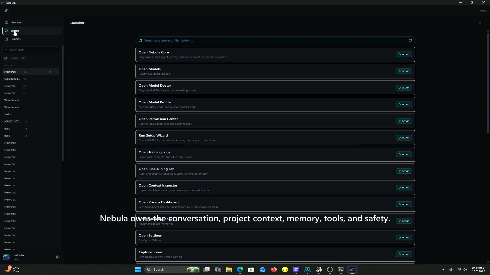
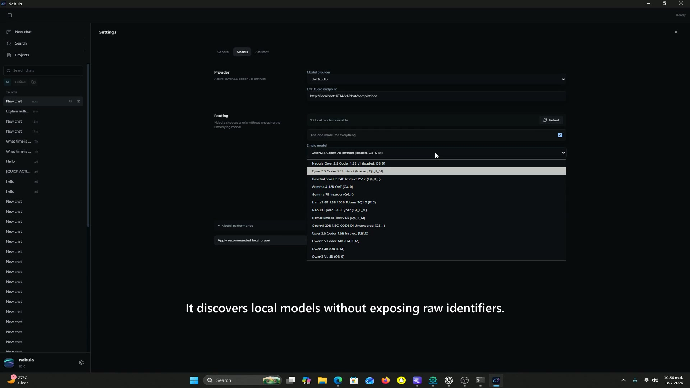

# Nebula

**A local AI operating layer for Windows and iPhone.**

Nebula turns local language models into one persistent assistant for chat, projects, memory, research, terminal work, voice, and mobile access. Models run through LM Studio on the user's PC; Nebula supplies the durable product around them: context, routing, tools, permissions, diagnostics, and a consistent identity.

Current release: **Nebula 2.0: Black Matter**.

[Download the latest Windows release](https://github.com/Jonardi123/jonard-os/releases/latest) | [Build Week notes](docs/BUILD_WEEK.md) | [Architecture](docs/ARCHITECTURE.md)



## Why Nebula

Local models are useful, but a model server alone does not remember projects, explain what tools ran, protect the computer, or follow the user to another device. Nebula keeps those responsibilities outside the model so users can swap runtimes without replacing the assistant.

- **Local-first:** prompts, projects, memory, and conversations remain on the PC by default.
- **One assistant, multiple engines:** automatic daily, coding, and review routing or a single-model mode.
- **Actions with receipts:** files, terminal jobs, app launches, web research, and approvals are logged without exposing hidden reasoning.
- **Shared context:** project awareness and reviewed memory survive model switches.
- **Private mobile companion:** the iPhone client connects to the user's own PC over a private HTTPS bridge.

## Working Capabilities

- Streaming LM Studio chat with model discovery, loading, fallback, health checks, and Stop
- SQLite-backed conversations, folders, search, recovery, timeline, tasks, and diagnostics
- Project profiles, file search, context pins, memory review, and replayable task runs
- Cancellable terminal jobs with streamed output, timeouts, process-tree termination, and execution receipts
- Approval, Safe, and session-only Full Access modes with permanent catastrophic-action blocks
- Installed-app discovery, aliases, audited launching, and ambiguity handling
- Web search and safe public-page fetch with sanitized source cards
- Skills registry, quick actions, agent activity, model dashboard, and benchmark tooling
- Windows voice overlay and native/PWA iPhone clients with shared history, attachments, Stop, and approvals
- Reproducible QLoRA data generation, validation, evaluation, merge, and GGUF preparation tooling



## Architecture

```text
Windows / iPhone UI
        |
Conversation + project storage
        |
Orchestrator -- context + memory -- skill registry
        |
Permissions and tool executor
        |
Runtime adapters (LM Studio today)
```

The React interface never talks directly to SQLite. Repository adapters call versioned Tauri storage commands. Agent runs share one cancellation controller across model readiness, context building, inference, tools, approvals, and review. LM Studio is the implemented runtime, but routing and storage are designed independently of any single model.

See [docs/ARCHITECTURE.md](docs/ARCHITECTURE.md) for the detailed system map and boundaries.

## Quick Start

### Requirements

- Windows 10 or 11
- [LM Studio](https://lmstudio.ai/) with its local server enabled
- Node.js 20+ and Rust only when building from source

### Install a release

1. Download the installer from [GitHub Releases](https://github.com/Jonardi123/jonard-os/releases/latest).
2. In LM Studio, download and load an instruction or coding GGUF that fits your hardware.
3. Start the LM Studio local server. Nebula defaults to `http://localhost:1234/v1/chat/completions`.
4. Open Nebula, choose the detected model, and optionally select a project folder.

Models are not bundled in the installer. Nebula can be used with any compatible model and does not require the project's experimental fine-tunes.

### Build from source

```powershell
npm.cmd install
npm.cmd run test
npm.cmd run build
npm.cmd run tauri:build
```

For development:

```powershell
npm.cmd run tauri:dev
```

The mobile web client is built with `npm.cmd run mobile:build`. Private pairing and native iOS notes are in [docs/MOBILE_PWA.md](docs/MOBILE_PWA.md) and [docs/IOS_NATIVE.md](docs/IOS_NATIVE.md). No private bridge address, pairing token, IPA, or signing material is included in this repository.

## Judge Path

1. Install Nebula and start it while LM Studio is offline to see recoverable setup behavior.
2. Start LM Studio, load a model, and select it from Nebula's model dropdown.
3. Send a normal chat message, then select a project and run **Review Project**.
4. Open Terminal and run a safe command such as `git status`; inspect its streamed receipt in Timeline.
5. Open Skills or web research and inspect the source cards and activity log.
6. Press Stop during a response or command and verify no late output resumes the run.

## Safety

Nebula defaults to **Allow Safe Executions**. **Ask for Approval** confirms every side effect. **Full Access** is session-only, requires typed confirmation, never elevates to administrator, and still cannot bypass permanent blocks for drive formatting, credential theft, security disabling, hidden execution, or destructive system-folder operations.

Tool retries are not automatic. Nebula does not claim an action succeeded without a confirmed tool result.

## Training

The repository includes reusable generators, validation gates, evaluation scripts, QLoRA configuration, and notebooks. Large generated corpora, model weights, adapters, GGUF files, local traces, and private memory remain excluded from Git.

Training is experimental and is not required to run Nebula. See [training/README.md](training/README.md).

## Build Week

The project predates Build Week. Between July 16 and July 19, 2026, Codex with GPT-5.6 helped extend and verify the native iPhone companion, mobile reliability, voice integration, model profiling, defensive-security training pipeline, Black Matter release, warm-model behavior, and live web research. Product direction, safety boundaries, test interpretation, and final decisions remained human-led.

The dated evidence and exact boundary between existing work and Build Week additions are documented in [docs/BUILD_WEEK.md](docs/BUILD_WEEK.md).

## License

[MIT](LICENSE), Copyright (c) 2026 Jonard.
